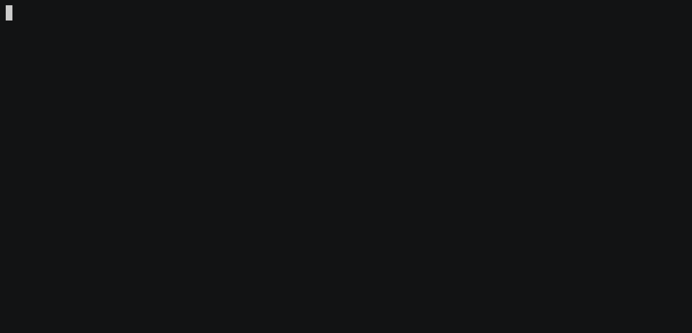
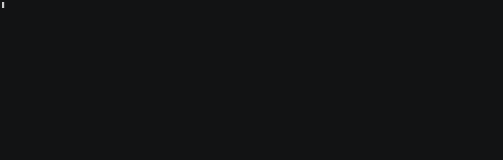

[](https://github.com/homeall/cloudflared/actions) [](https://img.shields.io/docker/pulls/homeall/cloudflared) [](#) [](#) [](#) [](#) [](https://ionut.vip)

# Docker image with [cloudflared](https://github.com/cloudflare/cloudflared) for *[DNS over HTTPS](https://www.cloudflare.com/en-gb/learning/dns/dns-over-tls/)*

<!-- TABLE OF CONTENTS -->
<details open="open">
  <summary>Table of Contents</summary>
  <ol>
    <li>
      <a href="#about-the-project">About The Project</a>
    </li>
    <li>
      <a href="#getting-started">Getting Started</a>
      <ul>
        <li><a href="#prerequisites">Prerequisites</a></li>
      </ul>
    </li>
    <li>
      <a href="#usage">Usage</a>
      <ul>
        <li><a href="#default-settings">Default Settings</a></li>
      </ul>
       <ul>
        <li><a href="#docker-run-command">Docker run command</a></li>
      </ul>
       <ul>
        <li><a href="#custom-upstreams-and-custom-port-number">Custom upstreams and custom port number</a></li>
      </ul>
       <ul>
        <li><a href="#dualstack-ipv4-ipv6">Dualstack Ipv4/IPv6</a></li>
      </ul>
    </li>
    <li><a href="#pihole">PiHole</a></li>
    <li><a href="#license">License</a></li>
    <li><a href="#contact">Contact</a></li>
    <li><a href="#acknowledgements">Acknowledgements</a></li>
  </ol>
</details>

## About The Project

The primary purpose of creating a custom docker image with only **[cloudflared](https://github.com/cloudflare/cloudflared)** was to use *[DNS over HTTPS](https://www.cloudflare.com/en-gb/learning/dns/dns-over-tls/)* with only **security** upstreams :arrow_down: including **three** DNSs (very good for [fail over](https://en.wikipedia.org/wiki/Failover)).

:heavy_exclamation_mark:It will be very useful in Docker environment or Kubernetes where [High Availability](https://en.wikipedia.org/wiki/High-availability_cluster) is a must.

I am using GitHub actions weekly where it will update cloudflared binary in order to keep up to date the docker image and the package.

You will find on the readme page how to use the commands with images.

It is advantageous for setting up together with :copyright: [PiHole](https://github.com/pi-hole/pi-hole).

:no_entry_sign: If you need ADs protection and privacy, this may help you in long term.

## ☕️ Support HomeAll

Enjoying my home lab and IT projects?  
[Buy me a coffee](https://buymeacoffee.com/homeall) to keep the ideas coming!

[](https://buymeacoffee.com/homeall)

<!-- GETTING STARTED -->
## Getting Started

:beginner: It will work on any Linux box amd64 or [Raspberry Pi](https://www.raspberrypi.org) with arm64 or arm32. 

### Prerequisites

[](https://github.com/homeall/cloudflared/blob/main/Dockerfile)

You will need to have:

* :whale: [Docker](https://docs.docker.com/engine/install/)
* :whale2: [docker-compose](https://docs.docker.com/compose/) 
 >This step is optional

<!-- USAGE -->
## Usage

### Default Settings

It will come with the following **security** upstreams *in this order*:

* :one: 1.1.1.3
* :two: security.cloudflare-dns.com
* :three: 1.1.1.2

:warning: Please review this [link](https://1.1.1.1/family/) in order to get more details about the upstreams above.

The default port is **54**.

The IP addres is **0.0.0.0**

### Docker run command: 

Unless you need to change the default setting, it will work as expected with the command below:

`docker run -d --name cloudflare -p "54:54" -p "54:54/udp" homeall/cloudflared:latest`

:hearts: On the status column of the docker, you will notice the `healthy` word. This is telling you that docker is running [healtcheck](https://scoutapm.com/blog/how-to-use-docker-healthcheck) itself in order to make sure it is working properly. 

:arrow_down: Please test yourself using the following command:

```
> docker inspect --format "{{json .State.Health }}" cloudflare | jq
{
  "Status": "healthy",
  "FailingStreak": 0,
  "Log": [
    {
      "Start": "2021-01-04T10:42:21.5982274Z",
      "End": "2021-01-04T10:42:21.6848715Z",
      "ExitCode": 0,
      "Output": "Server:\t\t127.0.0.1\nAddress:\t127.0.0.1#54\n\nName:\tcloudflare.com\nAddress: 104.16.133.229\nName:\tcloudflare.com\nAddress: 104.16.132.229\nName:\tcloudflare.com\nAddress: 2606:4700::6810:84e5\nName:\tcloudflare.com\nAddress: 2606:4700::6810:85e5\n\n"
    }
  ]
}
```
:arrow_down: Docker logs output:

```
INFO[2021-01-01T20:03:37Z] Adding DNS upstream - url: https://1.1.1.3/dns-query
INFO[2021-01-01T20:03:37Z] Adding DNS upstream - url: https://security.cloudflare-dns.com/dns-query
INFO[2021-01-01T20:03:37Z] Adding DNS upstream - url: https://1.1.1.2/dns-query
INFO[2021-01-01T20:03:37Z] Starting metrics server on 127.0.0.1:8080/metrics
INFO[2021-01-01T20:03:37Z] Starting DNS over HTTPS proxy server on: dns://0.0.0.0:54
```
:arrow_down: Simple tests:

```
❯ dig google.com @127.0.0.1 -p 54 +short
216.58.211.174
❯ dig google.com @127.0.0.1 +tcp -p 54 +short
216.58.211.174
```



:arrow_up: [Go on TOP](#about-the-project) :point_up:

### Custom upstreams and custom port number:  

You can change first two upstreams **DNS1** and **DNS2** and *port number*.

Change to fit your needs:

`docker run -d --name cloudflare -p "5454:5454" -p "5454:5454/udp" -e "DNS1=dns.google" -e "DNS2=1.1.1.1" -e "PORT=5454" homeall/cloudflared:latest`

:arrow_down: Output result:

```
INFO[2021-01-01T20:08:36Z] Starting metrics server on 127.0.0.1:8080/metrics
INFO[2021-01-01T20:08:36Z] Adding DNS upstream - url: https://dns.google/dns-query
INFO[2021-01-01T20:08:36Z] Adding DNS upstream - url: https://1.1.1.1/dns-query
INFO[2021-01-01T20:08:36Z] Adding DNS upstream - url: https://1.1.1.2/dns-query
INFO[2021-01-01T20:08:36Z] Starting DNS over HTTPS proxy server on: dns://0.0.0.0:5454
```



:arrow_up: [Go on TOP](#about-the-project) :point_up:

### Dualstack Ipv4 IPv6

:warning: You also can use:

`docker run --name cloudflare -d -p "54:54" -p "54:54/udp" -e "ADDRESS=::" homeall/cloudflared`

:arrow_down: Output result:

```
INFO[2021-01-02T14:38:53Z] Adding DNS upstream - url: https://1.1.1.3/dns-query
INFO[2021-01-02T14:38:53Z] Adding DNS upstream - url: https://security.cloudflare-dns.com/dns-query
INFO[2021-01-02T14:38:53Z] Adding DNS upstream - url: https://1.1.1.2/dns-query
INFO[2021-01-02T14:38:53Z] Starting metrics server on 127.0.0.1:8080/metrics
INFO[2021-01-02T14:38:53Z] Starting DNS over HTTPS proxy server on: dns://[::]:54
```
:arrow_down: Simple tests:

```
❯ dig google.com @::1 +tcp -p 54 +short
216.58.213.14
❯ dig google.com @::1 -p 54 +short
216.58.213.14
```


:arrow_up: [Go on TOP](#about-the-project) :point_up:

## [PiHole](https://github.com/pi-hole/pi-hole)

:copyright: [PiHole](https://github.com/pi-hole/pi-hole) with **cloudflared** is a match in heaven for privacy and ADs protection :bangbang:

:arrow_down: Check out this [docker-compose.yml](https://docs.docker.com/compose/):

```
services:
  pihole:
    container_name: pihole
    image: pihole/pihole:latest
    hostname: pihole
    ports:
      - "53:53/tcp"
      - "53:53/udp"
      - "80:80/tcp"
    environment:
      TZ: 'Europe/London'
      WEBPASSWORD: 'admin'
      ServerIP: '172.18.0.2'
      DNS1: '172.18.0.3#54'
      DNS2: 'no'
    volumes:
      - './etc-pihole/:/etc/pihole/'
    cap_add:
      - NET_ADMIN
    restart: unless-stopped
    networks:
      pihole_net:
        ipv4_address: 172.18.0.2

  cloudflare:
    restart: unless-stopped
    container_name: cloudflare
    image: homeall/cloudflared:latest
    links:
      - pihole
    ports:
      - "54:54/tcp"
      - "54:54/udp"
    environment:
      TZ: 'Europe/London'
    networks:
      pihole_net:
        ipv4_address: 172.18.0.3

networks:
  pihole_net:
    driver: bridge
    ipam:
     config:
       - subnet: 172.18.0.0/24
```
> You will have to use the network mode and hardcoded IP address on each container to forward correctly queries to Cloudflare.
> Otherwise, you may get issues config from dnsmask.d on PiHole.
> If you use networking host mode, it will forward correctly queries to localhost on 54 port.

 <!-- LICENSE -->
 ## License

:newspaper_roll: Check the [LICENSE](https://raw.githubusercontent.com/homeall/cloudflared/main/LICENSE) for more information.

<!-- CONTACT -->
## Contact

:red_circle: Please free to open a ticket on Github. Or [](https://buymeacoffee.com/homeall)

<!-- ACKNOWLEDGEMENTS -->
## Acknowledgements

* :tada: [@Visibilityspots](https://github.com/visibilityspots/dockerfile-cloudflared) :trophy:

* :tada: [@Cloudflared](https://github.com/cloudflare/cloudflared) :1st_place_medal:

* :tada: :copyright: [@PiHole](https://github.com/pi-hole/pi-hole) :medal_sports:

:arrow_up: [Go on TOP](#about-the-project) :point_up:
